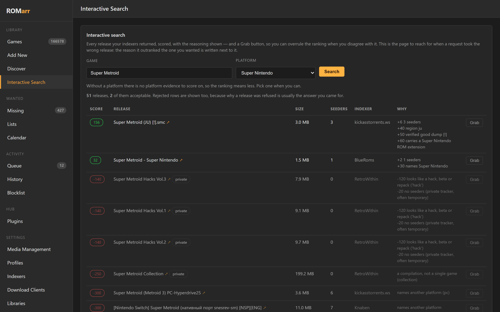
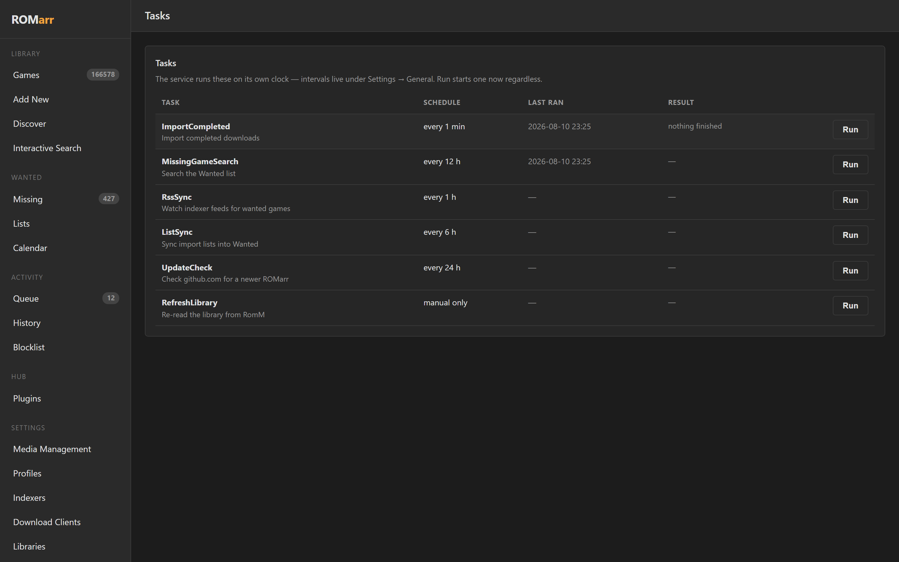
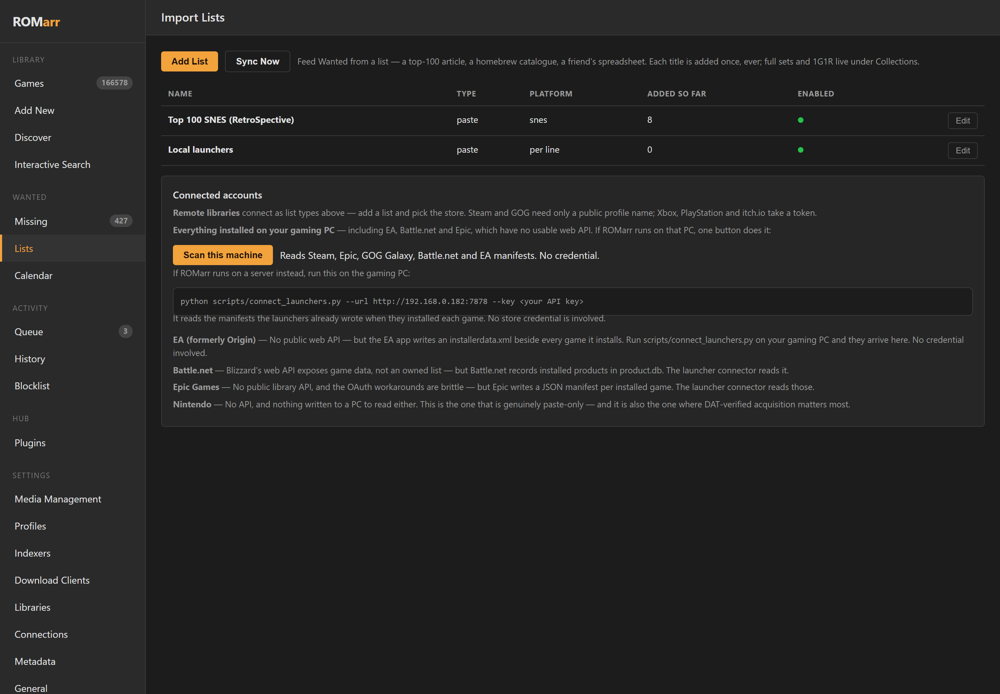
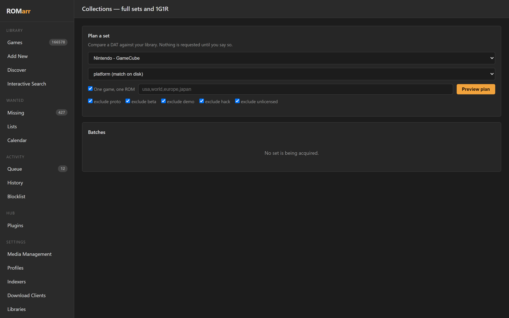
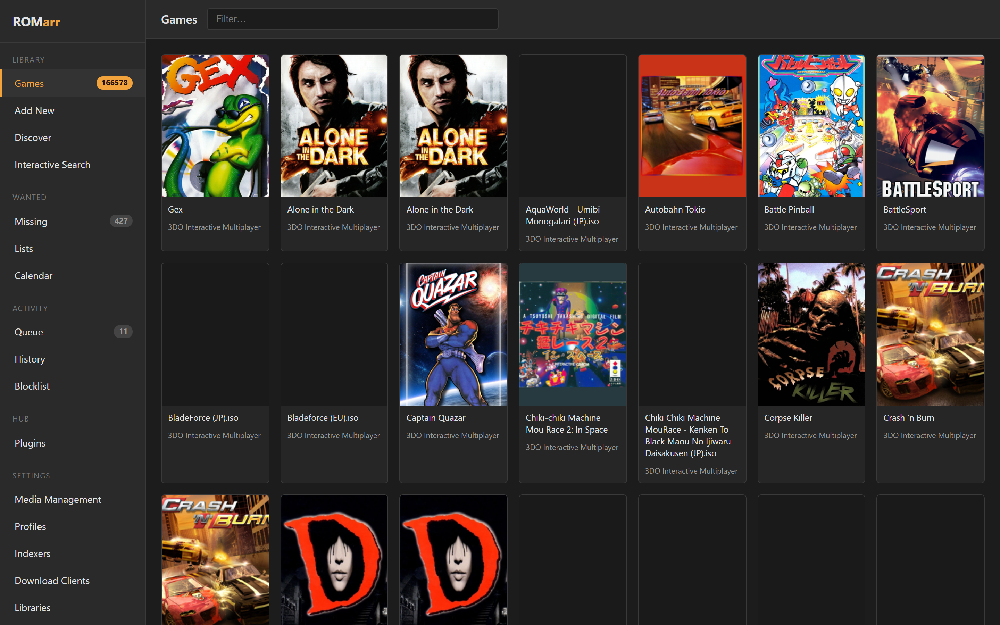
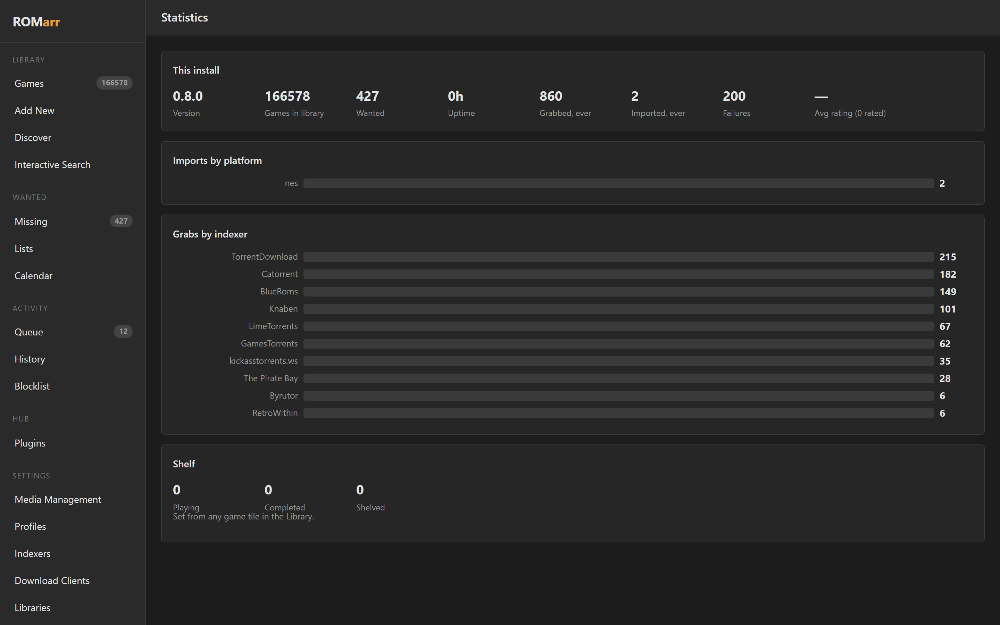
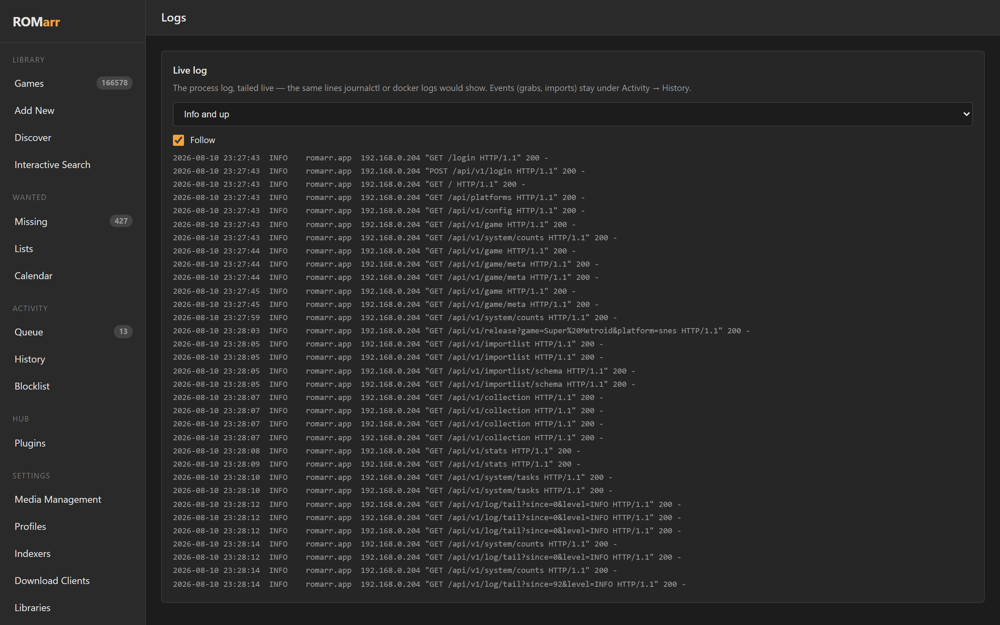
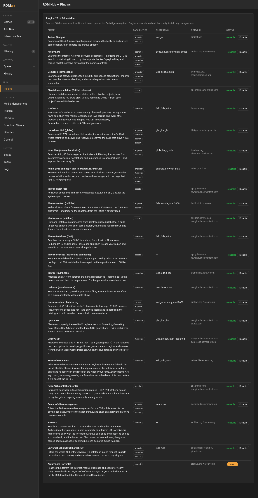
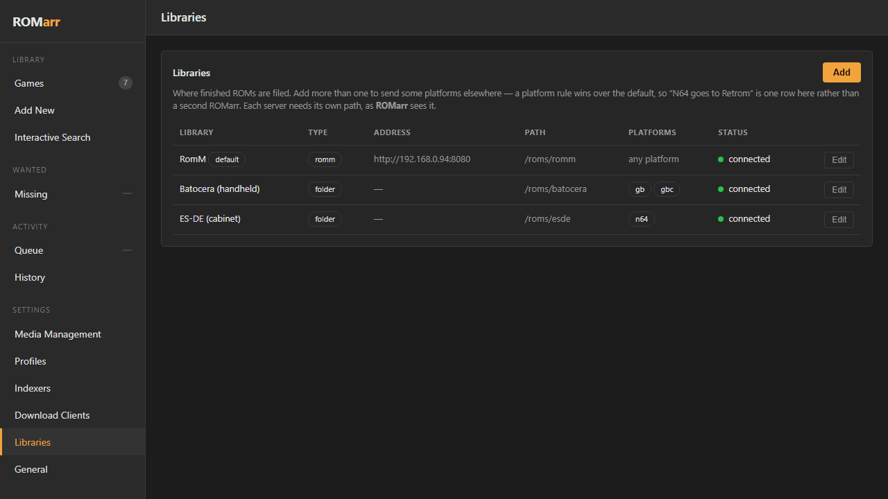

# ROMarr

**The *arr for games.** Request a title — ROMarr searches your indexers, picks the
best release, hands it to your download client, and files the ROM into your game
library.

```
Move Weight
└─ Yarr.It ................ one front door for a self-hosted media library
   └─ Cartridge ........... tools for self-hosting a retro game library
      └─ ROMarr ........... you are here
         └─ ROM Hub ....... ROMarr's plugin factory
```

ROMarr runs perfectly well on its own — nothing above it is required.

[ROM Hub](https://github.com/BlizzHacker/rom-hub) is ROMarr's plugin factory:
it is where a source is written, run and sandboxed, and ROMarr picks the
plugins up from its Hub tab. Adding a source means writing a plugin there, not
patching ROMarr.

If you run Radarr for films and Sonarr for TV, this is the missing one.

[](LICENSE)
[](https://github.com/BlizzHacker/romarr/pkgs/container/romarr)
[](#docker)



*A real search on a live install — 51 releases, the DAT-verified dump ranked
first at +50, romhacks and wrong-platform releases rejected with the reason
written next to each. Every screenshot in this README is from the
maintainer's production instance; [docs/PROOF.md](docs/PROOF.md) is the
full claim-by-claim evidence file.*

---

## Contents

- [How it works](#how-it-works)
- [The tour](#the-tour) — every feature, what it is for, and what it looks like
- [Requirements](#requirements)
- [Installation](#installation) — [Docker](#docker) · [Docker Compose](#docker-compose) · [Proxmox LXC](#proxmox-lxc) · [Home Assistant](#home-assistant) · [Source](#from-source)
- [Signing in](#signing-in)
- [Configuration](#configuration)
- [Usage](#usage)
- [Plugins](#plugins)
- [Multiple libraries](#multiple-libraries)
- [Troubleshooting](#troubleshooting)
- [Cartridge ecosystem](#cartridge-ecosystem)

---

## How it works

One request, end to end:

```
you: "Chrono Trigger, SNES"
  │
  ▼
SEARCH     every indexer at once, via Prowlarr or directly
  │          two queries per source — the bare title and the qualified one —
  │          because indexers match whole strings and recall wins
  ▼
SCORE      every release, with written reasons
  │          + seeders, + right region, + carries a .smc, + verified dump
  │          − hack/beta/repack, − wrong platform named, − too big to be real
  ▼
GRAB       the winner goes to whichever client speaks its protocol
  │          torrent → qBittorrent/Transmission/Deluge/rTorrent/Synology/Real-Debrid
  │          usenet  → SABnzbd/NZBGet
  ▼
IMPORT     within a minute of completion, on the clock
  │          the actual ROM picked out of the archive (zip/7z/rar, zip-slip safe)
  │          multi-track discs kept together as a set
  ▼
VERIFY     checksummed against your No-Intro / Redump DATs
  │          verified · bad dump · unknown — and only bad dumps are refused
  ▼
FILE       into RomM / Gaseous / Retrom / Gameyfin / a plain folder
  │          per-platform routing if you run more than one
  ▼
RESCAN     your library server is told; the game appears with art
```

Nothing in that pipeline needs you after the first line — and with lists,
connected accounts and RSS, it doesn't even need the first line.

## The tour

Everything below is real: each screenshot comes from the maintainer's
production install (166,578 games, ten live indexers), and every claim links
to its evidence in [docs/PROOF.md](docs/PROOF.md).

### Ask for a game, argue with the ranking

**Add New** takes a title and a platform and does the whole pipeline.
**Interactive Search** is for when you want to see the machine think: every
release your indexers returned, scored, with the reasoning written next to
it, a link to the release's page on its indexer, and a Grab button for when
you disagree. A manual grab flows through the same queue and history as an
automatic one.

The scoring knows things a film downloader can't: that a 40GB "SNES" result
is a romset or a PC port (every platform declares a hardware ceiling), that
"Super Nintendo Entertainment System" containing "Nintendo Entertainment
System" is a trap (longest alias wins, unknown platforms are refused, never
guessed), and that a Wii Virtual Console WAD is not a Genesis cartridge.

### Proof, not vibes: DAT verification

The one thing no other *arr can do. There is no canonical hash for a movie —
but No-Intro (cartridges) and Redump (discs) publish the CRC32/MD5/SHA1 of
every known-good dump. ROMarr checksums every import against your DATs:

- **verified** — byte-for-byte the published dump. Shown as `[!]` everywhere.
- **bad dump** — right size, wrong hash. The case worth catching; refused
  unless you explicitly force it.
- **unknown** — not in your DAT. *Not treated as bad*: homebrew,
  translations and romhacks live here and import without ceremony.

Copier headers are handled (the reason naive hashers match nothing on
NES/SNES), discs verify per-track, and **a verified dump automatically
upgrades an unverified copy** — the only upgrade rule in this category that
is a fact about bytes rather than a taste in bitrates.

### The clock



Five jobs run without you: completed downloads import **every minute**;
the Wanted list is re-searched every 12 hours with a **per-title backoff
ladder** (4h → 7 days, so a game that isn't dumped yet doesn't get your
tracker account banned); indexer **RSS feeds are watched hourly** in
between, so a release that appears an hour after you asked is grabbed
within the hour; lists sync every 6; and once a day ROMarr asks GitHub if a
newer version exists — and *tells* you, because an *arr that updates itself
is an *arr that restarts mid-import. Every RSS match goes through the same
scorer as a search: the feed can never grab what a search would refuse.
Intervals are editable live; zero disables a job.

### Lists, and the accounts that feed them



Paste a numbered "top 100" article exactly as you copied it — rank numbers,
`# comments` and `Title<TAB>platform` lines all parse. Point at a URL that
re-syncs on the clock. Every title feeds Wanted **once, ever** — a ledger
per list means a fulfilled game is never re-downloaded by its own list.

**Connect the stores you already own games on**, two ways:

| Route | Covers | What it needs |
|---|---|---|
| **Remote libraries** — list types | Steam, GOG | *nothing but a public profile name* |
| | Xbox, PlayStation, itch.io | a token you paste once |
| **Local launchers** — one button | Steam, Epic, GOG Galaxy, **Battle.net**, **EA** | *no credential at all* |

That second row is the interesting one. This README used to claim EA,
Battle.net and Epic "have no API" and could not be connected — which was
wrong, and Playnite and LaunchBox were the standing counter-example. They
read what the launcher already wrote to disk: Steam's `appmanifest_*.acf`,
Epic's JSON manifests, GOG Galaxy's SQLite database, Battle.net's
`product.db`, and the `installerdata.xml` EA drops beside every install.
ROMarr does the same — **Scan this machine** on the Lists page when ROMarr
runs on your gaming PC, or `scripts/connect_launchers.py` run there when it
doesn't. No OAuth, no scraped cookies, no store credential anywhere.

Nintendo is the one honest exception: no API, and nothing written to a PC
to read. It says so on the page.

### Collections: whole sets and 1G1R



Load a DAT, and ROMarr can answer "what does a complete set look like, and
how far off am I?" — full sets or **one-game-one-ROM** with your region
ladder, diffed against what's actually on disk, acquired in resumable
batches. A 3,000-title set is not an all-or-nothing operation: pause it,
resume it, retry the failures.

### The library is also a shelf



Click any tile: **playing / completed / shelved**, a 0–10 rating, and
notes. Wanted and owned are deliberately *derived* (from the wanted list
and the library) so nothing drifts. **Discover** adds the three storefront
shelves — popular, new, upcoming — browsable onto a Request button, and the
**Stats** page turns the history into numbers:



### Notifications that explain themselves

Discord, Slack, Telegram, Pushover, Gotify, ntfy, plain webhooks, and
Apprise (which unlocks ~100 more). Every other tool sends "Grabbed: Chrono
Trigger". ROMarr's message carries **what the scorer weighed** —
`+50 verified good dump [!], +40 region usa, +40 30 seeders` — so you can
tell a good pick from a lucky one without opening the UI.

### Boring, load-bearing



Auth is on by default (password + optional TOTP, API keys, ForwardAuth SSO
behind Authentik/Authelia); native HTTPS via `ROMARR_SSL_CERT`/`KEY`; the
**Logs** page tails the actual process log live; backups strip credentials
before they leave; Prometheus metrics and an OpenAPI spec for everything;
remote path mapping for clients on other hosts; and history, wanted, shelf
and settings all survive restarts. Prowlarr's API keys never reach a
browser or a log, archives cannot zip-slip out of the library root, and an
existing ROM is never silently overwritten.

## Requirements

| | |
|---|---|
| **Indexer** | Prowlarr, or any Torznab / Newznab indexer, or a plain torrent RSS feed |
| **Download client** | qBittorrent / Transmission / Deluge / rTorrent / Synology DS / Real-Debrid (torrent) and/or SABnzbd / NZBGet (usenet) |
| **Game library** | RomM, Gaseous, Retrom, or a directory on disk |
| **Runtime** | Docker, Home Assistant, or Python 3.11+ |

---

## Installation

### Docker

```bash
docker run -d --name romarr -p 6868:6868 \
  -e PUID=1000 -e PGID=1000 \
  -e PROWLARR_URL=http://prowlarr:9696 -e PROWLARR_API_KEY=... \
  -e LIBRARY_URL=http://romm:8080 -e LIBRARY_USERNAME=romarr -e LIBRARY_PASSWORD=... \
  -e QBITTORRENT_URL=http://qbittorrent:8080 \
  -v ./config:/config \
  -v /path/to/roms:/roms \
  -v /path/to/downloads:/downloads \
  ghcr.io/blizzhacker/romarr:latest
```

Open `http://localhost:6868`.

> **Upgrading from 0.6.x?** The default port changed from **7878 to 6868**.
> 7878 is Radarr's port, and running both is the normal case rather than the
> exception, so ROMarr was colliding with it on a default install. 6868 sits in
> the gap the \*arr family left between Bazarr (6767) and Whisparr (6969).
>
> If you pinned the port yourself — `ROMARR_PORT`, or a `7878:7878` mapping —
> nothing changes until you remove the pin. If you relied on the default,
> update your port mapping to `6868:6868`, or set `ROMARR_PORT=7878` to keep
> the old one.

Images are published for `linux/amd64`, `linux/arm64` and `linux/arm/v7`.

### Docker Compose

A [`docker-compose.yml`](docker-compose.yml) with every setting commented ships in
the repo:

```bash
curl -O https://raw.githubusercontent.com/BlizzHacker/romarr/main/docker-compose.yml
# edit the environment block
docker compose up -d
```

### Proxmox LXC

```bash
bash -c "$(curl -fsSL https://raw.githubusercontent.com/BlizzHacker/romarr/main/proxmox/ct/romarr.sh)"
```

### Home Assistant

Settings → Add-ons → Add-on Store → ⋮ → Repositories, add
`https://github.com/BlizzHacker/romarr`, install **ROMarr**. Options set on
the add-on page become ROMarr's environment — see
[homeassistant/romarr](homeassistant/romarr/README.md).

### From source

```bash
git clone https://github.com/BlizzHacker/romarr.git && cd romarr
pip install -r requirements.txt
cp .env.example .env          # edit it
set -a; . ./.env; set +a
python -m romarr
```

### Volume notes

| Volume | Notes |
|---|---|
| `/config` | Settings and history. Settings saved in the UI take precedence over environment variables from then on. |
| `/roms` | Your library root. Must be the same tree your library server scans. |
| `/downloads` | **The container-side path must match what your download client reports.** qBittorrent: Options → Downloads → "Save path". SABnzbd: Config → Folders → "Completed Download Folder". If they cannot match, set a mapping under Settings → Media Management. |

`PUID`/`PGID` set the ownership of imported ROMs — use the same ids as your library
application. Only `/config` is chowned.

---

## Signing in

ROMarr requires a credential. There is no open mode you can fall into by
forgetting to configure something.

**The first time you open the web UI**, it asks you to set a password. That is
the whole of first-run setup — there is no key to go and find first. Once set,
the install is claimed, that screen becomes a normal sign-in, and the password
survives restarts.

Your browser then holds a signed session cookie, so the key is never kept in
the page.

**To skip the setup screen entirely**, claim the install from its environment
before it starts. This is what a container template should do, because it
leaves no window in which an unclaimed ROMarr is reachable:

```bash
-e ROMARR_PASSWORD=choose-something-long
```

**For scripts and other *arrs**, use the API key. One is generated on first run
and shown under *Settings → General*; set `ROMARR_API_KEY` to pin it to a value
you choose. Present it any of three ways:

```bash
curl -H "X-Api-Key: $KEY"          http://localhost:6868/api/v1/game
curl -H "Authorization: Bearer $KEY" http://localhost:6868/api/v1/game
curl "http://localhost:6868/api/v1/game?apikey=$KEY"
```

An API key also signs a browser in, via *Use an API key instead* on the
sign-in screen — which is how you get back in if the password is lost: set
`ROMARR_API_KEY`, restart, and sign in with it.

### Authentication variables

| Variable | Description |
|---|---|
| `ROMARR_PASSWORD` | Claims the install at startup. No setup screen is shown. |
| `ROMARR_API_KEY` | Pins the API key. Setting it also counts as claiming the install. |
| `ROMARR_AUTH` | `forward` for SSO, or `disabled` to turn the gate off. Unset means normal password/key auth. |
| `ROMARR_SSO_PROVIDER` | `authentik` (default), `authelia`, `cloudflare`, `oauth2-proxy`. |
| `ROMARR_TRUSTED_PROXIES` | **Required for `forward`.** CIDRs allowed to assert identity. |
| `ROMARR_SSO_USER_HEADER` / `_GROUPS_HEADER` | Override the provider's default headers. |
| `ROMARR_SSO_GROUP` | Require membership of this group. |

Two-factor (TOTP) is enrolled from *Settings → General* and applies to
interactive sign-in. It deliberately does not gate the API key: a script cannot
be prompted, and a key is already a high-entropy secret.

`ROMARR_AUTH=disabled` means anything that reaches the port is in, including a
request that bypassed your proxy. If a proxy already authenticates, prefer
`ROMARR_AUTH=forward`, which keeps the proxy as the authority but verifies the
request actually came through it.

## Configuration

### Environment variables

| Variable | Required | Description |
|---|---|---|
| `PROWLARR_URL` / `PROWLARR_API_KEY` | recommended | Prowlarr instance for searching |
| `LIBRARY_KIND` | no | `romm` (default), `gaseous`, `retrom` or `folder` |
| `LIBRARY_URL` | yes¹ | Library server base URL |
| `LIBRARY_USERNAME` / `LIBRARY_PASSWORD` | yes¹ | Library credentials |
| `LIBRARY_API_KEY` | — | Alternative to username/password |
| `LIBRARY_PATH` | yes | Library root **as ROMarr sees it** (`/roms` in Docker) |
| `QBITTORRENT_URL` / `_USER` / `_PASS` | — | Torrent client |
| `SABNZBD_URL` / `SABNZBD_API_KEY` | — | Usenet client |
| `NZBGET_URL` / `NZBGET_USER` / `NZBGET_PASS` | — | Usenet client |
| `QBITTORRENT_CATEGORY` etc. | no | Download category per client (default `romarr`) |
| `GGREQUESTZ_URL` | no | Request front-end, shown on the status page |
| `STREAM_SERVER_URL` | no | Headless RetroArch stream server. Read-only; it is asked which platforms it can play, so PS2, GameCube, Wii, Dreamcast and 3DS are reported as playable rather than download-only |
| `ROMARR_DATA` | no | Path to the state file |
| `PUID` / `PGID` / `TZ` | Docker | Process user, group, timezone |

¹ Not required for `LIBRARY_KIND=folder`, which needs only `LIBRARY_PATH`.

Legacy `ROMM_*` variables are still read, so existing installs need no changes.

### Backends

| Backend | Import | Scan | Metadata | Artwork | Collections |
|---|:-:|:-:|:-:|:-:|:-:|
| **RomM** | ✅ | ✅ | ✅ | ✅ | ✅ |
| **Gaseous** | ✅ | ✅ | — | — | — |
| **Retrom** | ✅ | ✅ | ✅ | ✅ | — |
| **Folder** | ✅ | n/a | — | — | — |

`folder` covers Batocera, RetroPie, Recalbox, EmulationStation, ES-DE, EmuDeck,
Pegasus, Lakka, muOS, ArkOS, LaunchBox, Playnite and Steam ROM Manager — they read
ROMs from a directory laid out by platform, which is what ROMarr writes. No URL, no
account, no API key:

```
LIBRARY_KIND=folder
LIBRARY_PATH=/mnt/roms
```

### Supported platforms

58 platforms. The bar for inclusion is a real play route — a core in RomM's
base EmulatorJS map, or one installed on a stream server.

**Cartridge** — NES, Famicom, Famicom Disk System, SNES, Super Famicom, Game
Boy / Color / Advance, N64, Genesis / Mega Drive, Sega 32X, Master System,
Game Gear, Atari 2600 / 5200 / 7800, Lynx, Jaguar, TurboGrafx-16, SuperGrafx,
ColecoVision, Intellivision, Vectrex, WonderSwan / Color, Neo Geo Pocket /
Color, Neo Geo AES / MVS, Arcade, Virtual Boy, Nintendo DS, Nintendo 3DS.

**Disc** — PlayStation, PlayStation 2, PSP, Saturn, Sega CD / Mega-CD,
Dreamcast, GameCube, Wii, 3DO, Philips CD-i, PC-FX, TurboGrafx-CD / PC Engine
CD, Amiga CD32, Neo Geo CD, Atari Jaguar CD.

**Home computer** — Commodore 64 / 128 / VIC-20, Amiga, Amstrad CPC, ZX
Spectrum, MSX / MSX2, Sharp X68000, MS-DOS.

For Arcade, Neo Geo and DOS the archive **is** the ROM — MAME, FBNeo and
dosbox_pure open the `.zip` themselves and expect its internal layout, so
ROMarr imports it whole instead of unpacking a romset into loose chip dumps.

Disc images are multi-file. A `.cue` is a few hundred bytes of text naming
tracks, and importing it on its own gives you a library entry with a title, a
cover and no game — so ROMarr reads the sheet, takes every track it names, and
files the set as a directory, which is the layout RomM's scanner treats as one
multi-part ROM. `.7z` and `.rar` are read as well as `.zip`, because that is
what disc releases actually ship as.

### How each platform plays

**System → Platforms** answers this per platform for your own install. There
are four routes and the last one is not a failure:

| Route | What it is |
|---|---|
| **EmulatorJS** | In the browser, from your library server. Covers nine optical systems on a stock RomM: PlayStation, PSP, Saturn, Sega CD, 3DO, CD-i, PC-FX, TurboGrafx-CD and Amiga CD32. |
| **Stream** | A headless RetroArch server renders server-side and streams the video. This is how PS2, GameCube, Wii, Dreamcast, 3DS and Neo Geo CD play. Set `STREAM_SERVER_URL`. |
| **Archive.org** | Their in-page emulator. Real for cartridge and home-computer systems; Archive.org does **not** emulate disc systems, so ROMarr does not claim it for them. |
| **Download** | Always. |

**What still cannot play, and why.** ROMarr says this per platform on the
Platforms page rather than making you find out at the point of clicking play.

- **Atari Jaguar CD** — no emulator plays it. `virtualjaguar` is the only
  Jaguar core in libretro and declares `j64|jag|rom|abs|cof|bin|prg`:
  cartridges, no `cue`, no `chd`. MAME's own source marks its `jaguarcd`
  driver `MACHINE_NOT_WORKING`. Jaguar *cartridges* play fine.
- **Sharp X68000** — `px68k` is installed and needs Sharp's `iplrom.dat` and
  `cgrom.dat`, which you supply from your own hardware. There is no free
  equivalent the way C-BIOS exists for MSX.

Everything else on the list plays.

Everything else plays. Where a stream server has the core but not the
firmware it says *that*, because a core with no BIOS does not fail loudly: it
draws an error screen and streams it at a perfectly healthy 30 fps.

Nothing is refused on these grounds — cataloguing a platform you play
elsewhere is a legitimate thing to want. ROMarr tells you which route applies
before the grab instead of leaving you to find out at the point of clicking
play, and where a platform has no player it says what would fix it. If your
stream server has the core but not the firmware, it says *that*, because a
core with no BIOS does not fail loudly: it draws an error screen and streams
it at a perfectly healthy 30 fps.

---

## Usage

### Requesting a game

**Library → Add New.** Enter a title, pick a platform, click *Search & Grab*.
ROMarr searches, scores, grabs and imports.

### Interactive search

**Library → Interactive Search.** Every release is returned scored, with the
reasoning shown:

```
+40  20 seeders
+60  carries a Super Nintendo ROM extension
+25  region (USA)
-120 looks like a hack, beta or repack ('hack')
```

Rejected releases are listed greyed out with the reason. Grab whichever you want —
a manual grab goes through the same queue, history and wanted handling.

### API

| Endpoint | Description |
|---|---|
| `GET /api/v1/game` | The library |
| `GET /api/v1/wanted/missing` | Requested, not yet imported |
| `GET /api/v1/queue` | In flight |
| `GET /api/v1/history` | What happened |
| `GET /api/v1/release?game=…&platform=…` | Scored release list |
| `POST /api/v1/release/grab` | Grab a release by id |
| `POST /api/request` | Request one game |
| `POST /api/v1/command` | Run a task |
| `POST /api/v1/webhook` | Accept a request event from a front-end |
| `GET /api/v1/system/status` | Health of every dependency |

Download URLs are never returned to a client: Prowlarr's `downloadUrl` carries its
API key, so releases are grabbed by the id issued with the search and the URL is
resolved server-side.

---

## Plugins

**Hub → Plugins.** ROMarr's sources are [ROM Hub](https://github.com/BlizzHacker/rom-hub)
plugins — install, enable and disable them from the UI.



| Capability | Plugins | Examples |
|---|:-:|---|
| `search` | 10 | Internet Archive, No-Intro, Demozoo, Aminet, IF Archive, itch.io, ScummVM |
| `importer` | 10 | the same sources, importing the exact file |
| `metadata` | 12 | Hasheous, OpenVGDB, libretro DAT/Thumbnails, RetroAchievements, Ludusavi |
| `cores` | 2 | standalone emulators, libretro buildbot cores |
| `assets` | 3 | RetroArch controller profiles, overlays, cheats |
| `firmware` | 1 | Open BIOS (clean-room, openly licensed) |
| `stream` | 3 | resolve an item to a playable URL |
| `census` | 1 | enumerate a whole source into a local catalogue |

Install ROM Hub alongside ROMarr to enable the tab:

```bash
pip install "rom-hub @ git+https://github.com/BlizzHacker/rom-hub@master"
```

Plugins requiring an API key (e.g. RetroAchievements) are marked in the UI.

Plugins are third-party and sandboxed by the host — install only ones you trust.

**API:** `GET /api/v1/hub/plugins`, `POST /api/v1/hub/plugin` (`install`, `enable`,
`disable`, `uninstall`).

---

## Multiple libraries

**Settings → Libraries.** Each entry has its own address, credentials and filesystem
path; one is marked default.

Routing is by platform — a library with platform rules receives only those
platforms, everything else goes to the default. "N64 goes to Retrom" is one row on
that page rather than a second ROMarr instance.



Each server needs its own path **as ROMarr sees it**. The Libraries page flags a
server that answers while its path is missing locally — usually a volume that was
never mounted into ROMarr.

**Gaseous** has no scan trigger in its API and picks up files through its own
background tasks (`TitleIngestor` every minute over the *Import* directory;
`LibraryScan` every 1440 minutes over library paths). Point that library's path at
Gaseous's Import directory, or lower the `LibraryScan` interval.

**RomM** requires the account ROMarr uses to have permission to run tasks, or the
rescan is refused with a 403.

---

## Troubleshooting

| Symptom | Cause | Fix |
|---|---|---|
| "Download path does not exist" | The client reports a path ROMarr cannot see | Match the container-side download path, or set a mapping under Settings → Media Management |
| Results found then refused | No download client for that protocol | Add a client for torrent and/or usenet — the Download Clients page names the gap |
| `LIBRARY_PATH` change has no effect | A path saved in the UI outranks the environment | Change it on the Settings page |
| Imported ROM never appears | Library rescan refused | RomM: grant the account task permission. Gaseous: see above |
| ROM imports but will not play | Platform has no emulator core in the library's web player | Expected — the ROM is catalogued, not playable in-browser |
| Hub tab empty | ROM Hub not installed | `pip install "rom-hub @ git+https://github.com/BlizzHacker/rom-hub@master"` |

### Remote path mapping

```json
"remote_path_mappings": [
  { "remote": "/downloads", "local": "/mnt/downloads" }
]
```

Longest matching prefix wins. The log records both the path the client reported and
what ROMarr resolved it to.

---

## Security

- Prowlarr API keys are never returned to a browser or written to a log.
- Archive entries resolving outside the library root are dropped (zip-slip).
- Existing ROMs are never silently overwritten.
- Use a dedicated library account, not an administrator one.

## Development

```bash
python -m pytest tests/ -q
```

Release selection, ROM identification and archive-entry safety are pure functions
and are tested directly.

## State of the project

An honest map of what is solid, what is thin, and where a contribution
lands hardest. 1,170+ tests run on every push; the numbers below are per
area, and "tested against fakes" means the protocol conversation is
asserted but no live server was in the loop.

| Area | Confidence | Why |
|---|---|---|
| Release scoring & selection | **High** — 100+ tests | Pure functions; every scoring rule has a test naming the incident that motivated it |
| DAT verification (No-Intro/Redump) | **High** — 28 tests + live use | Copier headers, multi-track discs, bad-dump detection all covered; runs daily against a 166k-game library |
| Import pipeline (zip/7z/rar, zip-slip, multi-ROM sets) | **High** — 70+ tests | Includes the disc formats and the header-sniffing fallback |
| Auth (password, TOTP, API key, ForwardAuth SSO) | **High** — 100+ tests | HTTP-level tests: every route checked for the 401 it must return |
| Indexers (Prowlarr, Torznab, Newznab, RSS) | **High** — 66 tests, live use | Runs against a dozen live trackers daily |
| qBittorrent / SABnzbd / NZBGet | **High** — live use | The clients the maintainer runs |
| Transmission / Deluge / rTorrent | **High** — proven against live daemons | `scripts/live_proof.py`: 9/9 against real Transmission 4.1, Deluge 2.2 and rTorrent 0.9.8 — auth handshakes, adds, labels, listings |
| Synology DS / Real-Debrid | **Medium** — tested against fakes | The two that need hardware or a paid account. Protocol conversations asserted; `scripts/live_proof.py` extends to them the day someone runs it with either. **Reports welcome.** |
| Scheduler, RSS sync, import lists | **Medium-high** — 40+ tests, new | Shipped 2026-08-10; live on the maintainer's install |
| Steam / GOG / Xbox / PSN / itch.io list sources | **Medium** — tested against fakes | Credential-gated, so only an account holder can prove them live: `python scripts/account_proof.py <service>` does it in one command. **Run it, open an issue, get your name on the row.** |
| Library backends: RomM, folder | **High** — live use | |
| Library backends: Gaseous, Retrom, Gameyfin | **Medium** — tested against fakes/disk | Gaseous confirmed against a test instance; Retrom and Gameyfin **need field reports** |
| Frontend exports (LaunchBox, ES-DE, Playnite) | **Medium** — output asserted, apps not driven | The XML/JSON is tested; nobody has scripted LaunchBox itself |
| `contrib/` Playnite extension | **High** — runtime-proven | `scripts/playnite_proof.ps1`: runs against the real Playnite SDK 6.11 and a live export — 200 games imported as real SDK objects, dedupe verified |
| `contrib/` LaunchBox plugin | **Medium-high** — compiled + logic executed | `scripts/launchbox_proof/`: compiles clean, `Import()` runs against a live export with dedupe and platform auto-creation. The un-testable inch: LaunchBox's DLL is not redistributable, so the compile is against a reconstruction of its API |
| Home Assistant add-on | **New, lightly tested** | The options→environment bridge is tested; the add-on lifecycle needs HA users |
| armv7 Docker | **Degraded by design** | ROM Hub plugins unavailable there (no pydantic musl wheel); core works |

**Where help lands hardest:** field reports for the medium-confidence
download clients and library backends; a .NET owner for the contrib
plugins; Home Assistant users for the add-on; DAT sources for platforms
beyond No-Intro/Redump coverage; and issues — a report with a log line is
usually fixed the same week. Open issues:
[github.com/BlizzHacker/romarr/issues](https://github.com/BlizzHacker/romarr/issues).

---

## Cartridge ecosystem

ROMarr is the acquisition component of **Cartridge**, a self-hosted retro-gaming
stack by MoveWeight.

| | Project | Purpose |
|---|---|---|
| **Acquire** | [ROMarr](https://github.com/BlizzHacker/romarr) | Request, find, grab, file |
| | [ROM Hub](https://github.com/BlizzHacker/rom-hub) | Plugin host — the sources ROMarr searches |
| **Play** | [Desktop](https://github.com/BlizzHacker/RommForDesktop) · [Xbox](https://github.com/BlizzHacker/RommForXbox) · [Roku](https://github.com/BlizzHacker/RommForRoku) | Clients |
| | [Stream Server](https://github.com/BlizzHacker/RommStreamServer) | Remote play |
| **Above** | [Yarr.It](https://github.com/BlizzHacker/yarr-it) — [yarrit.com](https://yarrit.com) | The front door for a self-hosted media library. Ad-free torrent streaming that plays in the browser. |

Brand and naming: [BRAND.md](https://github.com/BlizzHacker/rom-hub/blob/master/BRAND.md).

## Acknowledgements

**[Questarr](https://github.com/Doezer/Questarr)** by Doezer (GPL-3.0).
Several ROMarr features landed after Questarr proved the demand for them in
a game *arr: the scheduled search / RSS-sync clock, per-game status,
ratings and notes, the stats page, the wider download-client roster
(Transmission, Deluge, rTorrent, Synology Download Station), native SSL,
and Home Assistant packaging. No code was taken — Questarr is TypeScript
and ROMarr is Python — but the case for those features was made there
first, and saying so costs nothing. As of August 2026 every capability on
their feature list and published roadmap has a ROMarr equivalent, and the
acquisitions here come with the one thing no title-parsing pipeline can
add: a checksum against the published dump.

**[gamarr](https://github.com/JeremiahM37/gamarr)** by JeremiahM37 (MIT).
Several features here exist because gamarr had them first and its README made
the case for them plainly: the blocklist, release profiles, quality profiles,
notification connections, tags, manual import, and Prometheus metrics. No code
was taken — gamarr is Go and ROMarr is Python, and every implementation here
was written from scratch — but the feature set was informed by theirs, and
saying so is the least that is owed.

**Radarr and Sonarr**, for the shape of the whole category: indexer and
download-client registries rendered from field definitions, quality and
release profiles, remote path mappings, and Manual Import.

**No-Intro** and **[Redump](http://redump.org)**, whose DATs make
verification possible at all. **[RomM](https://github.com/rommapp/romm)**,
whose EmulatorJS core map is the basis of the playability routing.


## Licence

MIT — see [LICENSE](LICENSE).

Unofficial. Not affiliated with or endorsed by the RomM, Gaseous or Retrom projects.
