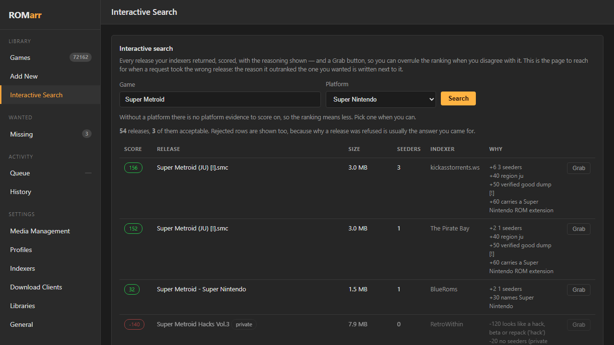

# ROMarr

**The *arr for games.** Request a title — ROMarr searches your indexers, picks the
best release, hands it to your download client, and files the ROM into your game
library.

If you run Radarr for films and Sonarr for TV, this is the missing one.

[](LICENSE)
[](https://github.com/BlizzHacker/romarr/pkgs/container/romarr)
[](#docker)



---

## Contents

- [Features](#features)
- [Requirements](#requirements)
- [Installation](#installation) — [Docker](#docker) · [Docker Compose](#docker-compose) · [Proxmox LXC](#proxmox-lxc) · [Source](#from-source)
- [Configuration](#configuration)
- [Usage](#usage)
- [Plugins](#plugins)
- [Multiple libraries](#multiple-libraries)
- [Troubleshooting](#troubleshooting)
- [Cartridge ecosystem](#cartridge-ecosystem)

---

## Features

- **Automated acquisition** — searches Prowlarr (or Torznab/Newznab indexers directly), scores releases, grabs the best, imports the ROM.
- **Release scoring** — ranks on seeders, region (USA → World → Europe → Japan) and size sanity; rejects hacks, betas, demos and compilations.
- **Interactive search** — every release scored with the reasoning shown, and a Grab button to override the ranking.
- **Multi-backend** — RomM, Gaseous, Retrom, or a plain folder (Batocera, RetroPie, ES-DE, EmuDeck, LaunchBox, Playnite…).
- **Multiple libraries** — route platforms to different servers from one instance.
- **Plugin sources** — 22 ROM Hub plugins add extra sources (Internet Archive, No-Intro, Demozoo, itch.io, homebrew, metadata and BIOS providers), managed from the Hub tab.
- **Torrent and Usenet** — qBittorrent, SABnzbd and NZBGet; each release routed to a client that speaks its protocol.
- **Remote path mapping** — for download clients running on another host or container.
- **Persistent state** — history, wanted list and settings survive restarts.

## Requirements

| | |
|---|---|
| **Indexer** | Prowlarr, or any Torznab / Newznab indexer |
| **Download client** | qBittorrent (torrent) and/or SABnzbd / NZBGet (usenet) |
| **Game library** | RomM, Gaseous, Retrom, or a directory on disk |
| **Runtime** | Docker, or Python 3.11+ |

---

## Installation

### Docker

```bash
docker run -d --name romarr -p 7878:7878 \
  -e PUID=1000 -e PGID=1000 \
  -e PROWLARR_URL=http://prowlarr:9696 -e PROWLARR_API_KEY=... \
  -e LIBRARY_URL=http://romm:8080 -e LIBRARY_USERNAME=romarr -e LIBRARY_PASSWORD=... \
  -e QBITTORRENT_URL=http://qbittorrent:8080 \
  -v ./config:/config \
  -v /path/to/roms:/roms \
  -v /path/to/downloads:/downloads \
  ghcr.io/blizzhacker/romarr:latest
```

Open `http://localhost:7878`.

Images are published for `linux/amd64`, `linux/arm64` and `linux/arm/v7`.

### Docker Compose

A [`docker-compose.yml`](docker-compose.yml) with every setting commented ships in
the repo:

```bash
curl -O https://raw.githubusercontent.com/BlizzHacker/romarr/main/docker-compose.yml
# edit the environment block
docker compose up -d
```

### Proxmox LXC

```bash
bash -c "$(curl -fsSL https://raw.githubusercontent.com/BlizzHacker/romarr/main/proxmox/ct/romarr.sh)"
```

### From source

```bash
git clone https://github.com/BlizzHacker/romarr.git && cd romarr
pip install -r requirements.txt
cp .env.example .env          # edit it
set -a; . ./.env; set +a
python -m romarr
```

### Volume notes

| Volume | Notes |
|---|---|
| `/config` | Settings and history. Settings saved in the UI take precedence over environment variables from then on. |
| `/roms` | Your library root. Must be the same tree your library server scans. |
| `/downloads` | **The container-side path must match what your download client reports.** qBittorrent: Options → Downloads → "Save path". SABnzbd: Config → Folders → "Completed Download Folder". If they cannot match, set a mapping under Settings → Media Management. |

`PUID`/`PGID` set the ownership of imported ROMs — use the same ids as your library
application. Only `/config` is chowned.

---

## Configuration

### Environment variables

| Variable | Required | Description |
|---|---|---|
| `PROWLARR_URL` / `PROWLARR_API_KEY` | recommended | Prowlarr instance for searching |
| `LIBRARY_KIND` | no | `romm` (default), `gaseous`, `retrom` or `folder` |
| `LIBRARY_URL` | yes¹ | Library server base URL |
| `LIBRARY_USERNAME` / `LIBRARY_PASSWORD` | yes¹ | Library credentials |
| `LIBRARY_API_KEY` | — | Alternative to username/password |
| `LIBRARY_PATH` | yes | Library root **as ROMarr sees it** (`/roms` in Docker) |
| `QBITTORRENT_URL` / `_USER` / `_PASS` | — | Torrent client |
| `SABNZBD_URL` / `SABNZBD_API_KEY` | — | Usenet client |
| `NZBGET_URL` / `NZBGET_USER` / `NZBGET_PASS` | — | Usenet client |
| `QBITTORRENT_CATEGORY` etc. | no | Download category per client (default `romarr`) |
| `GGREQUESTZ_URL` | no | Request front-end, shown on the status page |
| `ROMARR_DATA` | no | Path to the state file |
| `PUID` / `PGID` / `TZ` | Docker | Process user, group, timezone |

¹ Not required for `LIBRARY_KIND=folder`, which needs only `LIBRARY_PATH`.

Legacy `ROMM_*` variables are still read, so existing installs need no changes.

### Backends

| Backend | Import | Scan | Metadata | Artwork | Collections |
|---|:-:|:-:|:-:|:-:|:-:|
| **RomM** | ✅ | ✅ | ✅ | ✅ | ✅ |
| **Gaseous** | ✅ | ✅ | — | — | — |
| **Retrom** | ✅ | ✅ | ✅ | ✅ | — |
| **Folder** | ✅ | n/a | — | — | — |

`folder` covers Batocera, RetroPie, Recalbox, EmulationStation, ES-DE, EmuDeck,
Pegasus, Lakka, muOS, ArkOS, LaunchBox, Playnite and Steam ROM Manager — they read
ROMs from a directory laid out by platform, which is what ROMarr writes. No URL, no
account, no API key:

```
LIBRARY_KIND=folder
LIBRARY_PATH=/mnt/roms
```

### Supported platforms

Cartridge-era systems: NES, SNES, Game Boy / Color / Advance, N64, Genesis /
Mega Drive, Master System, Game Gear, Atari 2600 / 7800, Lynx, TurboGrafx-16,
WonderSwan, Neo Geo Pocket, Virtual Boy.

Disc-based platforms are excluded — multi-gigabyte images that browser emulators
cannot stream.

---

## Usage

### Requesting a game

**Library → Add New.** Enter a title, pick a platform, click *Search & Grab*.
ROMarr searches, scores, grabs and imports.

### Interactive search

**Library → Interactive Search.** Every release is returned scored, with the
reasoning shown:

```
+40  20 seeders
+60  carries a Super Nintendo ROM extension
+25  region (USA)
-120 looks like a hack, beta or repack ('hack')
```

Rejected releases are listed greyed out with the reason. Grab whichever you want —
a manual grab goes through the same queue, history and wanted handling.

### API

| Endpoint | Description |
|---|---|
| `GET /api/v1/game` | The library |
| `GET /api/v1/wanted/missing` | Requested, not yet imported |
| `GET /api/v1/queue` | In flight |
| `GET /api/v1/history` | What happened |
| `GET /api/v1/release?game=…&platform=…` | Scored release list |
| `POST /api/v1/release/grab` | Grab a release by id |
| `POST /api/request` | Request one game |
| `POST /api/v1/command` | Run a task |
| `POST /api/v1/webhook` | Accept a request event from a front-end |
| `GET /api/v1/system/status` | Health of every dependency |

Download URLs are never returned to a client: Prowlarr's `downloadUrl` carries its
API key, so releases are grabbed by the id issued with the search and the URL is
resolved server-side.

---

## Plugins

**Hub → Plugins.** ROMarr's sources are [ROM Hub](https://github.com/BlizzHacker/rom-hub)
plugins — install, enable and disable them from the UI.


| Capability | Plugins | Examples |
|---|:-:|---|
| `search` | 10 | Internet Archive, No-Intro, Demozoo, Aminet, IF Archive, itch.io, ScummVM |
| `importer` | 10 | the same sources, importing the exact file |
| `metadata` | 12 | Hasheous, OpenVGDB, libretro DAT/Thumbnails, RetroAchievements, Ludusavi |
| `cores` | 2 | standalone emulators, libretro buildbot cores |
| `assets` | 3 | RetroArch controller profiles, overlays, cheats |
| `firmware` | 1 | Open BIOS (clean-room, openly licensed) |
| `stream` | 3 | resolve an item to a playable URL |
| `census` | 1 | enumerate a whole source into a local catalogue |

Install ROM Hub alongside ROMarr to enable the tab:

```bash
pip install "rom-hub @ git+https://github.com/BlizzHacker/rom-hub@master"
```

Plugins requiring an API key (e.g. RetroAchievements) are marked in the UI.

Plugins are third-party and sandboxed by the host — install only ones you trust.

**API:** `GET /api/v1/hub/plugins`, `POST /api/v1/hub/plugin` (`install`, `enable`,
`disable`, `uninstall`).

---

## Multiple libraries

**Settings → Libraries.** Each entry has its own address, credentials and filesystem
path; one is marked default.

Routing is by platform — a library with platform rules receives only those
platforms, everything else goes to the default. "N64 goes to Retrom" is one row on
that page rather than a second ROMarr instance.


Each server needs its own path **as ROMarr sees it**. The Libraries page flags a
server that answers while its path is missing locally — usually a volume that was
never mounted into ROMarr.

**Gaseous** has no scan trigger in its API and picks up files through its own
background tasks (`TitleIngestor` every minute over the *Import* directory;
`LibraryScan` every 1440 minutes over library paths). Point that library's path at
Gaseous's Import directory, or lower the `LibraryScan` interval.

**RomM** requires the account ROMarr uses to have permission to run tasks, or the
rescan is refused with a 403.

---

## Troubleshooting

| Symptom | Cause | Fix |
|---|---|---|
| "Download path does not exist" | The client reports a path ROMarr cannot see | Match the container-side download path, or set a mapping under Settings → Media Management |
| Results found then refused | No download client for that protocol | Add a client for torrent and/or usenet — the Download Clients page names the gap |
| `LIBRARY_PATH` change has no effect | A path saved in the UI outranks the environment | Change it on the Settings page |
| Imported ROM never appears | Library rescan refused | RomM: grant the account task permission. Gaseous: see above |
| ROM imports but will not play | Platform has no emulator core in the library's web player | Expected — the ROM is catalogued, not playable in-browser |
| Hub tab empty | ROM Hub not installed | `pip install "rom-hub @ git+https://github.com/BlizzHacker/rom-hub@master"` |

### Remote path mapping

```json
"remote_path_mappings": [
  { "remote": "/downloads", "local": "/mnt/downloads" }
]
```

Longest matching prefix wins. The log records both the path the client reported and
what ROMarr resolved it to.

---

## Security

- Prowlarr API keys are never returned to a browser or written to a log.
- Archive entries resolving outside the library root are dropped (zip-slip).
- Existing ROMs are never silently overwritten.
- Use a dedicated library account, not an administrator one.

## Development

```bash
python -m pytest tests/ -q
```

Release selection, ROM identification and archive-entry safety are pure functions
and are tested directly.

---

## Cartridge ecosystem

ROMarr is the acquisition component of **Cartridge**, a self-hosted retro-gaming
stack by MoveWeight.

| | Project | Purpose |
|---|---|---|
| **Acquire** | [ROMarr](https://github.com/BlizzHacker/romarr) | Request, find, grab, file |
| | [ROM Hub](https://github.com/BlizzHacker/rom-hub) | Plugin host — the sources ROMarr searches |
| **Play** | [Desktop](https://github.com/BlizzHacker/RommForDesktop) · [Xbox](https://github.com/BlizzHacker/RommForXbox) · [Roku](https://github.com/BlizzHacker/RommForRoku) | Clients |
| | [Stream Server](https://github.com/BlizzHacker/RommStreamServer) | Remote play |

Brand and naming: [BRAND.md](https://github.com/BlizzHacker/rom-hub/blob/master/BRAND.md).

## Licence

MIT — see [LICENSE](LICENSE).

Unofficial. Not affiliated with or endorsed by the RomM, Gaseous or Retrom projects.
